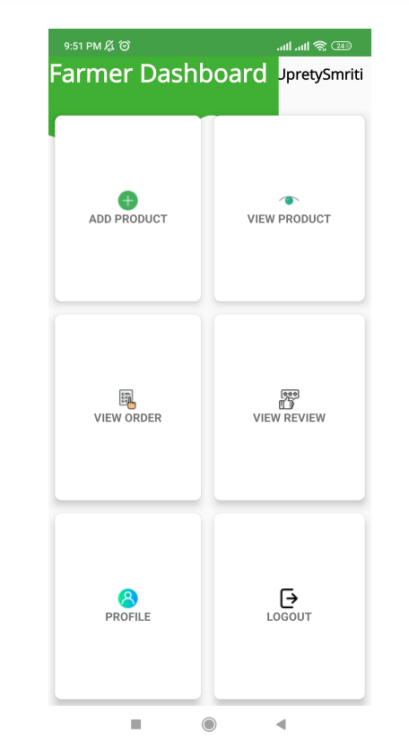
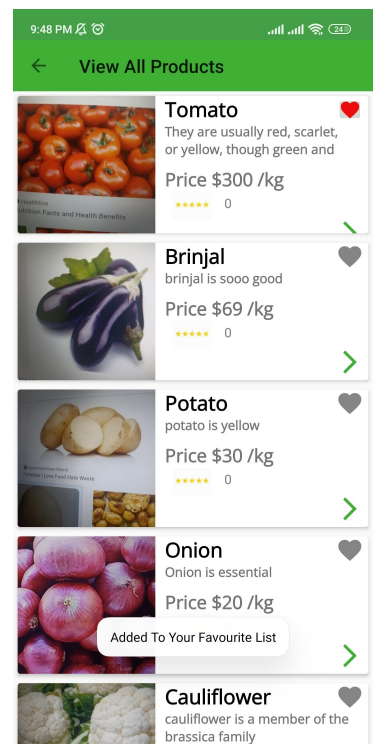
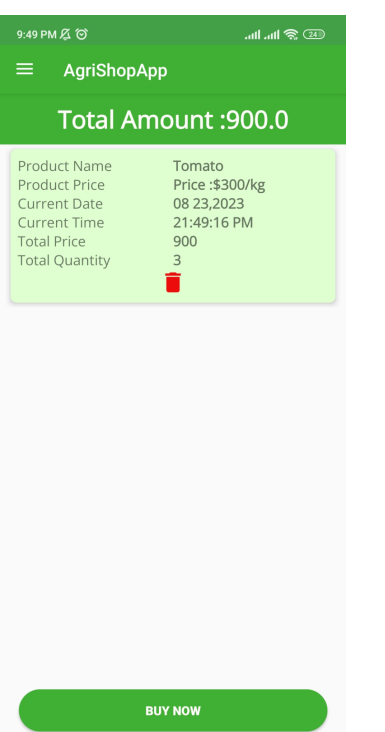

# 🌿 Agri-Shop - E-commerce Platform for Agricultural Products  

An online marketplace for farmers and consumers to buy and sell agricultural products seamlessly.  

## 📌 Features  
✅ User Authentication (Signup/Login)  
✅ Product Listing & Categories  
✅ Cart & Checkout System  
✅ Order Tracking 

## 🛠️ Tech Stack  
- **Language:** Java (Android)  
- **Database:** Firebase Firestore  
- **Authentication:** Firebase Auth  
- **Cloud Storage:** Firebase Storage  

## 🎥 Demo & Screenshots  
  
  
  


## 📥 Installation Guide  
1️⃣ Clone the repository  
```bash
git clone git@github.com:Shraddha-glitch/agri-shop.git
```
2️⃣ Open the project in Android Studio
3️⃣ Connect Firebase to the project
4️⃣ Run the project on an emulator or physical device
